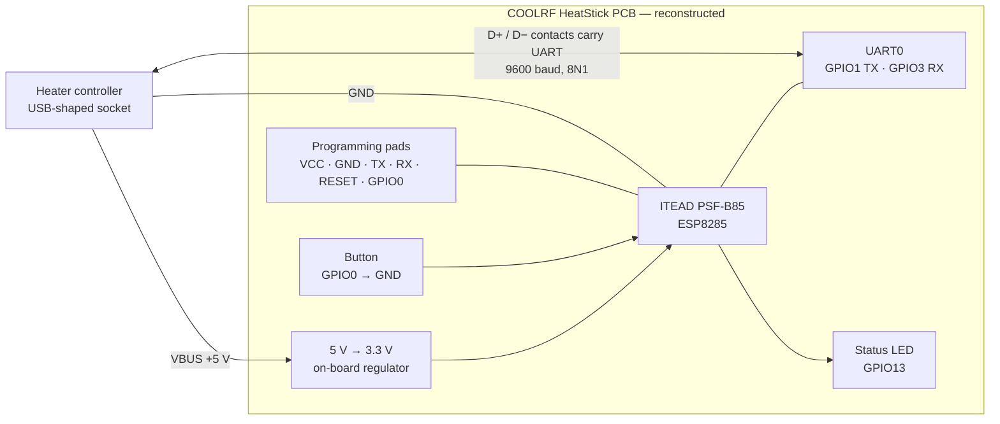

# COOLRF HeatStick for ESPHome

[Русское описание](README_RU.md) | English

Modern ESPHome firmware for the original COOLRF HeatStick (ESP8285) used with
Ballu Digital Inverter controllers, including BCT/EVU-I.

## What changed

- Migrated from the removed `custom_component` API to a local external component.
- Added a native Home Assistant climate entity.
- Fixed the mode feedback loop that could repeatedly switch the heater after
  changing from `No frost` back to `Comfort`.
- Added a streaming UART parser that handles fragmented and consecutive packets.
- Unknown protocol values are logged and ignored instead of crashing the device.
- Added periodic state synchronization and safe command handling before the
  first valid state packet is received.
- Updated the configuration for ESPHome 2026.9 and its current OTA syntax.
- Restored the HeatStick board LED control on GPIO13.
- Restored the physical GPIO0 button for factory reset and Wi-Fi pairing.

## Hardware

Target board: the original COOLRF HeatStick with ESP8285.

The heater communication bus uses UART0 at 9600 baud:

- TX: GPIO1
- RX: GPIO3
- 8 data bits, no parity, 1 stop bit

Serial logging is disabled because the same UART is connected to the heater.
Runtime logs remain available through the ESPHome native API.

### Reconstructed hardware diagram

The original COOLRF PCB schematic was not published. The project author also
[confirmed in the Habr discussion](https://habr.com/ru/companies/coolrf/articles/589381/comments/)
that no board schematic was available publicly. The diagram below is therefore
a **reconstructed functional diagram**, not the original production schematic.
It contains only connections confirmed by the firmware, hardware testing, the
[COOLRF article](https://habr.com/ru/companies/coolrf/articles/589381/) and the
[ITEAD PSF-B85 documentation](https://wiki.iteadstudio.com/PSF-B85).



The USB-shaped connector does **not** carry USB protocol. Its two data contacts
are reused for the UART pair. The public sources do not identify which specific
contact, D+ or D−, is TX and which is RX, so that unverified mapping is
intentionally omitted. The official circuit for the Wi-Fi module itself is
available from ITEAD as the
[PSF-B85 schematic](https://wiki.iteadstudio.com/File:PSF-B85_SCH.pdf).

## Button and status LED

Hold the physical HeatStick button for 5 seconds to erase saved preferences and
enter Wi-Fi pairing mode. Connect to the `Ballu Digital Inverter Fallback`
access point and open `http://192.168.4.1` to enter new Wi-Fi credentials. The
fallback AP password is the `fallback_password` value from `secrets.yaml`.

The GPIO13 LED patterns are:

- solid — Wi-Fi is connected;
- one short flash every two seconds — Wi-Fi is disconnected;
- fast blinking — the fallback access point is ready for pairing;
- solid while held — the physical button is pressed.

The `LED` switch in Home Assistant and the web interface enables or disables
automatic LED indication. Button-hold feedback remains enabled so a factory
reset is visible.
GPIO0 is also an ESP8266 boot strap pin: do not power-cycle or reset the stick
while holding the physical button.

## Build

1. Copy `secrets.example.yaml` to `secrets.yaml`.
2. Replace all example values with your Wi-Fi credentials.
3. Validate and compile:

```powershell
.\.venv\Scripts\esphome.exe config coolrf-heatstick.yaml
.\.venv\Scripts\esphome.exe compile coolrf-heatstick.yaml
```

The initial serial image is generated as:

```text
.esphome/build/ballu-heatstick/.pioenvs/ballu-heatstick/firmware.factory.bin
```

## First installation

Disconnect the HeatStick from the heater before connecting a 3.3 V USB-to-UART
programmer. Never connect the programmer while the HeatStick is powered by the
heater. Back up the existing flash before erasing or writing it.

Do not install the current build on an unattended heater. The first hardware
test must be supervised and should verify:

1. State is received without UART checksum errors.
2. On/off and target temperature each generate one command.
3. `Comfort -> No frost -> Comfort` does not cause repeated switching.
4. Controls on the heater are reflected in Home Assistant without being echoed
   back as new commands.

## Repository layout

- `coolrf-heatstick.yaml` — current ESP8285 configuration.
- `components/heatstick/` — maintained ESPHome component.
- `coolrf-heatstick-legacy.yaml` and `coolrf-heatstick.h` — original firmware,
  retained for protocol comparison.
- `README-legacy.md` — original project documentation.

## Status

Version `0.2.5` compiles successfully for ESP8285 with ESPHome 2026.9.0
and has been tested on a Ballu Digital Inverter BCT/EVU-I. Home Assistant,
the web interface, climate control, display control, operating modes and the
`Comfort -> No frost -> Comfort` feedback-loop fix have been verified. The
restored physical reset/pairing button and automatic LED patterns have also
been verified on the original HeatStick hardware.

Automatic power control and manual `Level 1` through `Level 5` commands work on
the tested BCT/EVU-I. In `No frost` mode the heater intentionally forces Level 1
and rejects other power levels.

`Current power level` reports the selected stage in manual mode because the
heater leaves its `actual_power` protocol field at zero. In `Auto`, it reports
the dynamically measured `actual_power` value and filters the controller's
invalid transient value 7.

The stock control panel always reaches `Auto` through Level 1. Some BCT/EVU-I
controllers can shut down after a direct high manual level to `Auto` command.
Firmware 0.2.5 therefore reproduces the panel sequence: it switches to Level 1,
waits five seconds without blocking ESPHome, and then enables `Auto`. Repeated
Level 5 to `Auto` hardware tests completed without a shutdown.
