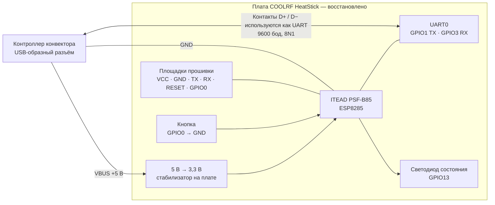

# COOLRF HeatStick для ESPHome

Русский | [English](README.md)

Современная прошивка ESPHome для оригинального стика COOLRF HeatStick на базе
ESP8285. Предназначена для управления конвекторами Ballu Digital Inverter,
включая модель BCT/EVU-I, через Home Assistant или встроенный веб-интерфейс.

## Что изменено

- Старый `custom_component`, удалённый из новых версий ESPHome, заменён локальным
  внешним компонентом.
- Добавлена полноценная климатическая сущность Home Assistant.
- Исправлено бесконечное включение и выключение конвектора после перехода
  `Незамерзание -> Комфорт`.
- Реализован потоковый обработчик UART, корректно принимающий разделённые и
  следующие подряд пакеты.
- Неизвестные значения протокола записываются в журнал и игнорируются, а не
  приводят к аварийному завершению.
- Добавлены периодический запрос состояния и безопасная отправка команд после
  получения первого корректного пакета от конвектора.
- Конфигурация обновлена для ESPHome 2026.9 и современного формата OTA.
- Добавлен встроенный веб-интерфейс на порту 80.
- Возвращено управление светодиодом платы HeatStick на GPIO13.
- Возвращена физическая кнопка GPIO0 для сброса и сопряжения с Wi-Fi.

## Возможности

- Включение и выключение конвектора.
- Установка требуемой температуры.
- Режимы `Комфорт`, `Ночь` и `Незамерзание`.
- Управление дисплеем конвектора.
- Включение и выключение светодиода на плате HeatStick.
- Сброс сетевых настроек и запуск первичного подключения физической кнопкой.
- Отображение текущей температуры и фактической мощности.
- Управление через Home Assistant, ESPHome API и веб-интерфейс.
- Обновление прошивки по Wi-Fi.

## Оборудование

Целевая плата — оригинальный COOLRF HeatStick с ESP8285. Для связи с
конвектором используется UART0 со скоростью 9600 бод:

- TX — GPIO1;
- RX — GPIO3;
- 8 бит данных, без бита чётности, 1 стоп-бит.

Вывод журнала в последовательный порт отключён, поскольку UART0 занят связью с
конвектором. Журнал доступен через ESPHome API.

### Восстановленная схема подключения

Оригинальная принципиальная схема платы COOLRF публично не выкладывалась. Автор
проекта также [подтвердил это в обсуждении на Хабре](https://habr.com/ru/companies/coolrf/articles/589381/comments/).
Поэтому ниже приведена **восстановленная функциональная схема**, а не исходная
производственная схема платы. В неё включены только соединения, подтверждённые
прошивкой, аппаратными тестами,
[статьёй COOLRF](https://habr.com/ru/companies/coolrf/articles/589381/) и
[документацией ITEAD PSF-B85](https://wiki.iteadstudio.com/PSF-B85).



USB-образный разъём **не использует протокол USB**: два контакта данных заняты
линиями UART. В публичных источниках не указано, какой именно контакт D+ или D−
является TX, а какой RX, поэтому неподтверждённая привязка намеренно не показана.
Официальная принципиальная схема самого Wi-Fi-модуля опубликована ITEAD:
[схема PSF-B85](https://wiki.iteadstudio.com/File:PSF-B85_SCH.pdf).

## Кнопка и индикация состояния

Для сброса сохранённых настроек и перехода в режим первичного подключения
удерживайте физическую кнопку HeatStick 5 секунд. После начала быстрого мигания
светодиода подключитесь к точке доступа `Ballu Digital Inverter Fallback` и
откройте `http://192.168.4.1`. Пароль точки доступа задаётся параметром
`fallback_password` в `secrets.yaml`.

Светодиод GPIO13 показывает состояние устройства:

- горит постоянно — Wi-Fi подключён;
- короткая вспышка раз в две секунды — соединение с Wi-Fi потеряно;
- быстро мигает — точка доступа и страница первичной настройки готовы;
- горит постоянно во время удержания — физическая кнопка нажата.

Переключатель `LED` в Home Assistant и веб-интерфейсе включает или отключает
автоматическую индикацию. Индикация удержания физической кнопки остаётся
активной, чтобы сброс был заметен.

GPIO0 также используется ESP8266 для выбора режима загрузки. Не перезагружайте
и не включайте питание стика, удерживая физическую кнопку.

## Установка через ESPHome Device Builder

1. Скопируйте в каталог `/config/esphome/` файл `coolrf-heatstick.yaml` и папку
   `components/heatstick/`.
2. Добавьте в `/config/esphome/secrets.yaml`:

```yaml
wifi_ssid: "имя вашей Wi-Fi сети"
wifi_password: "пароль Wi-Fi"
fallback_password: "пароль резервной точки доступа"
```

3. Обновите страницу ESPHome Device Builder и откройте устройство
   `ballu-heatstick`.
4. Для уже работающего стика выберите `Install`, затем `Wirelessly`. Если имя
   устройства не определяется в сети, временно добавьте его IP-адрес в секцию
   `wifi:`:

```yaml
wifi:
  use_address: 192.168.x.x
```

Подробная инструкция находится в [DEVICE-BUILDER-INSTALL.md](DEVICE-BUILDER-INSTALL.md).

## Локальная сборка

1. Скопируйте `secrets.example.yaml` в `secrets.yaml`.
2. Укажите в нём параметры своей Wi-Fi сети.
3. Проверьте конфигурацию и соберите прошивку:

```powershell
.\.venv\Scripts\esphome.exe config coolrf-heatstick.yaml
.\.venv\Scripts\esphome.exe compile coolrf-heatstick.yaml
```

Готовый файл для первичной прошивки через UART:

```text
.esphome/build/ballu-heatstick/.pioenvs/ballu-heatstick/firmware.factory.bin
```

## Первая прошивка через UART

Перед подключением программатора отключите HeatStick от конвектора. Используйте
только USB–UART-программатор с логическими уровнями 3,3 В. Нельзя одновременно
питать стик от конвектора и программатора. Перед стиранием желательно сохранить
резервную копию штатной прошивки.

Первую проверку проводите под наблюдением:

1. Убедитесь, что состояние приходит без ошибок контрольной суммы UART.
2. Проверьте включение, выключение и изменение температуры.
3. Проверьте переход `Комфорт -> Незамерзание -> Комфорт`: повторных
   самопроизвольных включений и выключений быть не должно.
4. Проверьте, что команды со штатной панели появляются в Home Assistant и не
   отправляются обратно как новые команды.

## Текущее состояние

Версия `0.2.5` успешно собирается для ESP8285 с ESPHome 2026.9.0 и проверена
на Ballu Digital Inverter BCT/EVU-I. Подтверждена работа Home Assistant,
веб-интерфейса, климатической сущности, дисплея, режимов и исправления цикла
включения/выключения. Восстановленные функции физической кнопки и автоматические
режимы светодиода также проверены на оригинальном HeatStick.

Автоматическое управление мощностью и ручные уровни `Level 1`–`Level 5` работают
на проверенном BCT/EVU-I. В режиме «Незамерзание» конвектор штатно принудительно
выбирает Level 1 и отклоняет другие уровни мощности.

Датчик `Current power level` в ручном режиме показывает выбранную ступень,
поскольку конвектор оставляет поле `actual_power` протокола равным нулю. В
режиме `Auto` датчик показывает фактическую динамическую ступень мощности и
отбрасывает ошибочное переходное значение 7, которое иногда выдаёт контроллер.

Штатная панель всегда переходит в `Auto` через Level 1. Некоторые контроллеры
BCT/EVU-I могут выключить конвектор при прямом переходе с высокой ручной ступени
в `Auto`. Поэтому версия 0.2.5 повторяет безопасную последовательность панели:
сначала включает Level 1, неблокирующе ждёт пять секунд и затем включает `Auto`.
Повторные аппаратные тесты перехода Level 5 → Auto прошли без выключения.

## Структура репозитория

- `coolrf-heatstick.yaml` — актуальная конфигурация ESP8285.
- `components/heatstick/` — поддерживаемый компонент ESPHome.
- `coolrf-heatstick-legacy.yaml` и `coolrf-heatstick.h` — исходная версия,
  сохранённая для сравнения протокола.
- `README-legacy.md` — документация исходного проекта.
